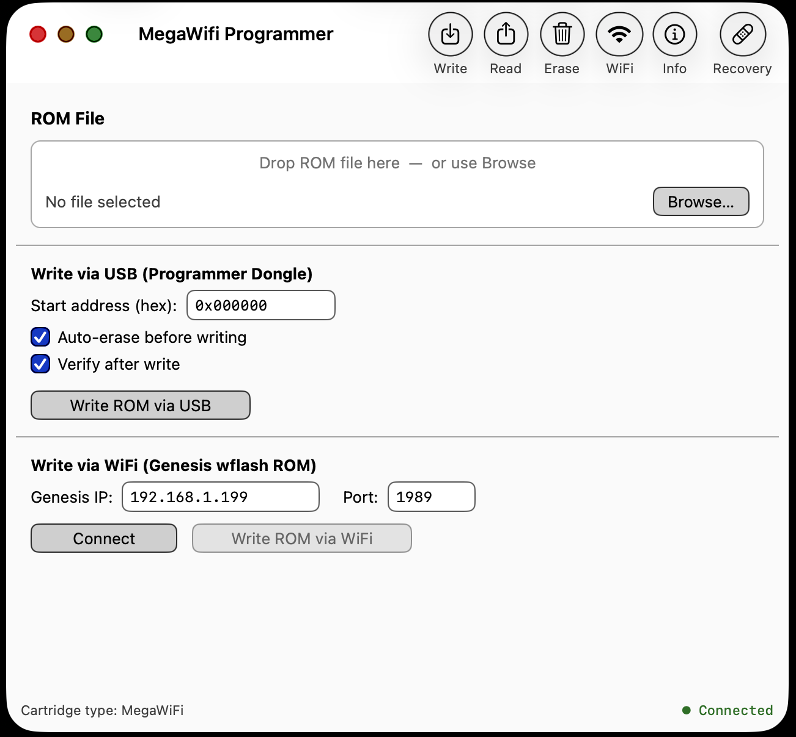

# MegaWifi Programmer

A native macOS application for reading, writing, erasing, and recovering the flash memory of [MegaWiFi](https://github.com/doragasu/mw-mdma-fw) and FrugalMapper cartridges for the Sega Genesis / Mega Drive. Communicates with the MDMA USB programmer dongle over libusb and supports wireless ROM delivery via the Genesis wflash WiFi loader.

<p align="center">
  
</p>

---

## Features

### Write
- **Write ROM via USB** — programs a binary ROM image directly to cartridge flash through the MDMA USB programmer dongle
  - Configurable start address (hex)
  - Auto-erase before write (range erase, not full chip — fast)
  - Read-back verify after write
  - Chunked 64 KB transfers with live speed and ETA display
- **Write ROM via WiFi** — delivers a ROM over TCP to a Genesis running the wflash WiFi loader ROM
  - Connects to any IP:port (default port 1989)
  - Queries bootloader address from the running wflash ROM and patches the ROM header so the wflash menu survives after a power cycle
  - ROM size guard: rejects images that would overwrite the wflash bootloader
  - Chunked transfer with live progress

### Read
- Reads flash contents to a binary file on disk
- Configurable start address and length
- Chunked 64 KB reads with live speed and ETA display

### Erase
- **Full chip erase** — erases the entire flash (up to ~2 minutes, uses chip-erase command)
- **Range erase** — erases a specific address range by sector

### WiFi
- Configure up to three AP credential slots (SSID, password, PHY mode)
- Read back stored AP configuration from the cartridge
- Join / leave a configured AP slot
- Query live WiFi status (FSM state, online flag, active AP slot)

### Info
- Displays programmer firmware version (major.minor.micro)
- Flash chip manufacturer ID and device IDs
- Full flash memory layout: total size, number of regions, sector count and size per region
- Pushbutton state
- **Cartridge type selector** — switch between MegaWiFi and FrugalMapper drivers; auto-prompts on connect when multiple driver keys are detected

### Flash Recovery
- One-click full restore of the bundled wflash WiFi loader firmware (v1.2, 2026-01-04)
  - Shows firmware version, release date, file size, and MD5 checksum
  - Clickable link to the upstream release package
  - Complete erase → write → verify cycle at address 0x000000
- **Custom binary override** — browse for any binary image and flash it instead of the bundled firmware; MD5 of the selected file is shown before flashing

---

## Requirements

- macOS 11.0 Big Sur or later (Apple Silicon and Intel)
- MDMA USB programmer dongle with firmware v1.3.0 or later
- **No Homebrew or third-party dependencies** — libusb 1.0.29 is vendored and built from source

---

## Installation

Download `MegaWifiProgrammer.dmg` from the [Releases](https://github.com/mikewolak/MacMegaWifiProgrammer/releases) page, open it, and drag the app to your Applications folder.

On first launch macOS may show a Gatekeeper warning because the app is not notarized. To open it: **right-click → Open → Open**.

---

## Building from Source

Requires only Xcode Command Line Tools — no Homebrew, no additional packages.

```bash
git clone git@github.com:mikewolak/MacMegaWifiProgrammer.git
cd MacMegaWifiProgrammer
make
```

The app bundle is produced at `build/MegaWifiProgrammer.app`.

```bash
make run      # build and launch
make dmg      # build a distributable DMG at build/MegaWifiProgrammer.dmg
make clean    # remove all build artifacts
```

---

## Hardware

The MDMA programmer dongle is an AT90USB646 AVR microcontroller running at 8 MHz. It connects to the Mega Drive cartridge slot edge connector and appears to the host as a USB HID/bulk device (VID `0x03EB`, PID `0x206C`).

Firmware sources and DFU flashing instructions: [mw-mdma-fw](https://github.com/doragasu/mw-mdma-fw)
wflash WiFi loader ROM: [mw-wflash](https://gitlab.com/doragasu/mw-wflash)

---

## Credits

Original MDMA firmware and protocol: [doragasu](https://github.com/doragasu)
macOS application: mikewolak, 2015–2026
